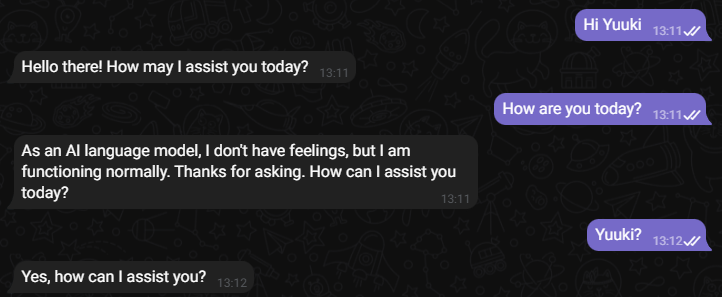
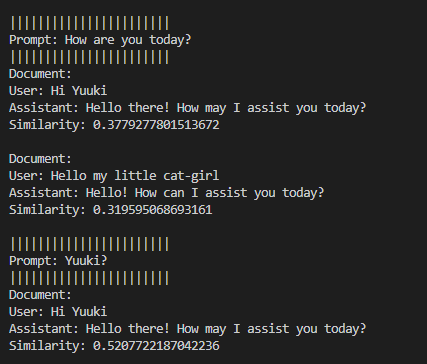
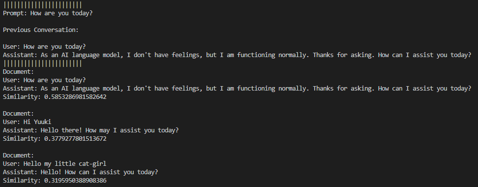

# long_term_memory_chat
Welcome! This project leverages code from the [hyperDB](https://github.com/jdagdelen/hyperDB) repository, a powerful database

The LTM_chat (long_term_memory_chat) Chat Assistant is an AI-powered bot built on OpenAI's GPT-3.5 model. The key feature of this assistant is its long-term memory capabilities, allowing it to remember and reference past conversations for an engaging and dynamic user experience.

## Features
- Long-term memory for retaining conversation history
- Ability to query previous conversations for context awareness and richer responses
- Multiple personas for varied interaction styles

  
# How it works
The core functionality of the chat assistant is in the handle_message function(main.py). 
Here is a brief rundown of its operation:
1. The function retrieves the current conversation history.
2. It appends the user's message to the conversation history.
3. The database is queried with the user's message and any results with similarity scores over a certain threshold (0.55 in this example) are filtered out.
4. These highly similar previous conversations, if any, are added to the user's message as 'Previous Conversation'.
5. The entire conversation history, including the user's latest message and any relevant 'Previous Conversations', is sent to the GPT-3.5 model.
6. The model generates a response which is added to the conversation history.
7. This updated conversation history is stored in the database and the database is saved to disk.
8. Finally, the assistant's response is sent back to the user.

Here's an example of how this process works:


When the user prompts "How are you today?", the assistant queries the database with the prompt, and the similar past conversations are added to the prompt as 'Previous Conversation':



This augmented prompt is then sent to the GPT-3.5 model for response generation.


# Setup & Installation
## Prerequisites
- Python 3.7+
- pip (Python package installer)

  
## Steps
1. Clone the repository:
```
git clone https://github.com/CCRss/long_term_memory_chat.git
```
2. Change the working directory to long_term_memory_chat:
```
cd long_term_memory_chat
```
3. Install the required packages using pip:
```
pip install -r requirements.txt
```
4. Update the api_keys.json file with your OpenAI key and Telegram key:
```
{
"openai_key": "Your OpenAI key here", 
"telegram_key": "Your Telegram key here"
}
```


# Usage
To start the chat assistant, run the following command:
```
python main.py
```
You can choose different bot personalities using the /start command.


# Contributing
Pull requests are welcome. For major changes, please open an issue first to discuss what you would like to change.


# License
This project is licensed under the MIT License. See [LICENSE](LICENSE) for more information.
